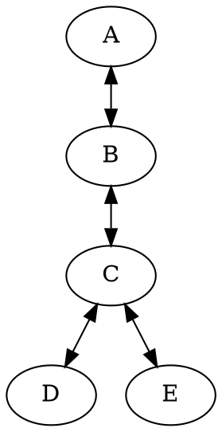

# Cluster of Peers
This directory contains scripts which configure a group networked peers, all communicating with one another using Fabric's P2P messaging components.

## Quick Start

0. Let your working directory be the Fabric repository.
1. Run `node examples/cluster/node-a.js`
2. Run `node examples/cluster/node-b.js`
3. Run `node examples/cluster/node-c.js`
4. Run `node examples/cluster/node-d.js`
5. Run `node examples/cluster/node-e.js`

## Network Topology
